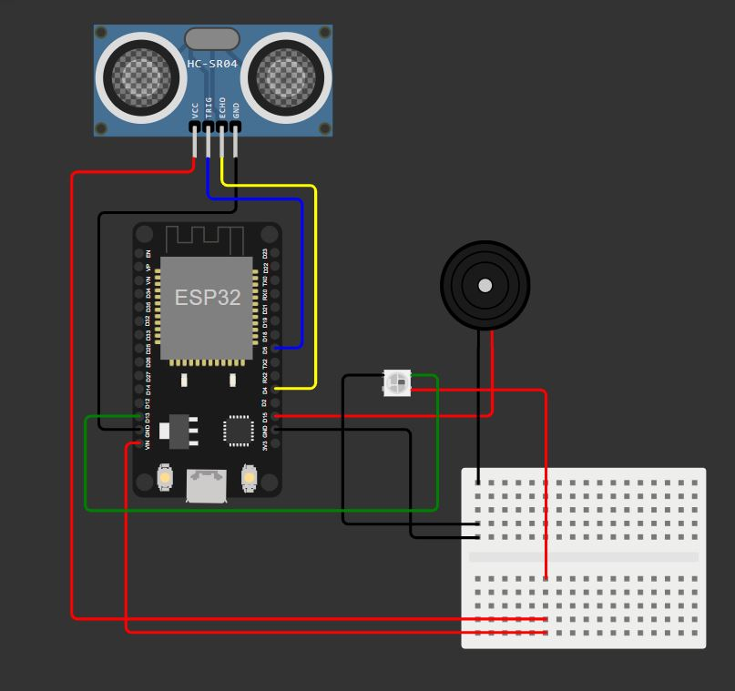

# Owlficina - Microcontroladores ESP32

<p align="center">
Sensor para baliza só que mais irritante<br/> 
  
  Por [Luís Kanazawa](https://github.com/Kawagui) e [Thiago Padrão](https://github.com/thiagotpadrao)
</p>
<br/>

## :pushpin: Descrição

O projeto consiste em detectar uma presença e emitir um som e luz com cor, neste caso quanto mais próximo do sensor o som fica mais agudo e mais repetitivo e a cor do Led se aproxima do vermelho simbolizando um alerta como fosse manobrar um veículo para fazer baliza por exemplo. 

Mas o circuito e sistema podem ter outras aplicações, como uma brincadeira de quente ou frio, improvisar um instrumento, verificar se dois objetos estão a uma distância segura entre eles...

<br/>

## :robot: Montagem do dispositivo físico

### Lista de materiais

| Quantidade | Nome | Link para referência |
| --- | --- | --- |
| 1 | ESP32 e cabo USB | https://www.baudaeletronica.com.br/placa-doit-esp32-bluetooth-e-wifi.html |
| 1 | Buzzer ativo programável | https://www.eletrogate.com/buzzer-ativo-5v?utm_source=Site&utm_medium=GoogleMerchant&utm_campaign=GoogleMerchant&gad=1&gclid=Cj0KCQjwk96lBhDHARIsAEKO4xauBy1Zdvprys4j1ThOaqRjedv45X4-ec5x3n0ZeytOvHP0reTzkQkaAu_0EALw_wcB |
| 1 | Sensor de distância ultrassônico HC-SR04 | https://www.baudaeletronica.com.br/produto/sensor-de-distancia-ultrassonico-hc-sr04.html |
| 1 | NeoPixel Led RGB (WS2812) | https://pt.aliexpress.com/item/1005001971806517.html?src=google |
| X | Jumpers variados | --- |
| 1 | Protoboard | --- |
| 1 | Fonte de alimentação - PowerBank | https://www.americanas.com.br/produto/2706391331 |

#### ❕ Disclaimer
O Led RGB utilizado neste circuito é diferente do que se encontra na imagem do circuito e também da referência

### Lista de conexões

| Componente | Pino da placa |
| --- | --- |
| Sensor de Distância (Trigger) | 5 |
| Sensor de Distância (Echo) | 4 |
| Led RGB | 13 |
| Buzzer | 15 |


### 🔧 Funcionamento dos sensores e atuadores

#### Sensor de distância ultrassônico HC-SR04

Para começar uma medida, o pino TRIG do módulo deve receber um pulso alto, ou seja, 5V do microcontrolador por pelo menos 10us, isso vai iniciar o sensor, o qual vai enviar 8 ciclos de sinal ultrasônico a 40kHz e esperar pelo mesmo sinal refletido. Quando o sensor detecta o sinal de volta, ele vai setar o pino ECHO em nível lógico alto, ou seja, 5V e vai esperar por um período que é proporcional à distância. Para obter a distância, basta medir o tempo que o pino Echo fica com nível lógico alto, ou seja:

Tempo = Largura do Pulso em Echo, em micro segundos

Logo, Distância em centímetros = Tempo / 58

ou Distância em polegadas = Tempo / 148

Ou você pode usar a velocidade do som, que é de 340m/s.

(Especificação técnica: https://d229kd5ey79jzj.cloudfront.net/620/HCSR04.pdf)

Suas principais características são: 

- Tensão de Alimentação: 5VDC;
- Corrente quiescente: < 2mA;
- Corrente em funcionamento: 15mA;
- Ângulo de medida: < 15°;
- Distância de detecção: de 2cm a 400cm;
- Resolução: 3mm;
- Dimensões: 45mm x 20mm x 15mm;
- Frequência ultrasônica: 40kHz;

#### NeoPixel Led RGB (WS2812)
O WS2812B é uma fonte de luz LED de controle inteligente através de um fio de dados, onde o circuito de controle e o chip RGB estão integrados em um pacote de componentes 5050. Ele inclui internamente uma porta digital inteligente, trava de dados e um circuito de amplificação de sinal e driver. Também inclui um oscilador interno de precisão e uma parte de controle de corrente constante programável de 12V, garantindo efetivamente que a cor de luz do ponto de pixel seja altamente consistente. (Especificação técnica: https://www.utmel.com/components/ws2812b-addressable-rgb-led-datasheet-pinout-and-applications?id=534)

Suas principais características são: 
- Proteção inteligente contra conexão reversa: a conexão reversa da fonte de alimentação não danifica o circuito integrado (IC).
- O circuito de controle e o LED compartilham a única fonte de alimentação.
- O circuito de controle e o chip RGB estão integrados em um pacote de componentes 5050, formando um ponto de controle de pixel completo.
- Circuito de reformulação de sinal embutido: após a reformulação da onda, o sinal é enviado ao driver seguinte, garantindo que a distorção da forma de onda não se acumule.
- Circuito de reset elétrico e circuito de reset em caso de falha de energia embutidos.
- Cada pixel das três cores primárias pode exibir 256 níveis de brilho, completando uma exibição de 16.777.216 cores (exibição em cores completas), com frequência de varredura não inferior a 400Hz/s.
- Porta de cascata para transmissão de sinal por uma única linha.
- A distância entre dois pontos pode ser superior a 5 metros para transmissão de sinal sem a necessidade de circuitos adicionais.
- Quando a taxa de atualização é de 30fps, o número de pontos em cascata não é inferior a 1024.
- A taxa de envio de dados é de 800Kbps.
- A cor da luz é altamente consistente, proporcionando uma ótima relação custo-benefício.

### Circuito

<p align="center">
Figura - Diagrama do circuito<br/>
  <br/>
</p>
Os fios pretos foram usados para representar a conexão com pino GND;

Os fios vermelhos foram usados para representar a conexão de alimentação do componente;

<br/>

## :electric_plug: Funcionamento do sistema

**Não esqueça: adicione um videozinho do sistema funcionando :)**

**(No momento vamos ficar devendo o vídeo 😰)**

Quando o sistema detecta uma presença, a depender da distância, emite uma frequência sonora e luminosa. As principais partes são:
1. Obter uma distância entre uma presença e o sensor;
2. Atribuir uma cor e frequência sonora para um intervalo de distâncias;

Em relação ao cálculo da distância, foi utilizado uma classe já pronta (disponível [aqui](https://randomnerdtutorials.com/micropython-hc-sr04-ultrasonic-esp32-esp8266/), incluindo documentação). Esta classe faz toda a configuração de pinagem, liberação dos pulsos e conversão da distância em centímetros ou milímetros.

A configuração do Led foi feita usando o módulo neopixel
``` Python
from libdis import HCSR04
from time import sleep_ms
import machine
import neopixel

# Configuração do pino e quantidade de LEDs
pino_led = 13  # Altere para o pino que você conectou o DATA IN
num_leds = 1   # Número de LEDs na sequência

# Inicializa o controle dos LEDs
np = neopixel.NeoPixel(machine.Pin(pino_led), num_leds)

# Função para acender o LED em uma cor específica (RGB)
def acender_led(r, g, b):
    np[0] = (r, g, b)
    np.write()

# Inicializa o sensor e buzzer
sensor = HCSR04(trigger_pin=5, echo_pin=4, echo_timeout_us=10000)
buzzer = machine.PWM(machine.Pin(15))

``` 
A forma utilizada para atribuir o som e cor para cada intervalo foi passar a distância obtida por uma cachoeira de if's
``` Python
# Segue um exemplo para o caso de uma distância estar entre 0 a 20 cm
distancia = sensor.distance_cm()      # Método da classe que entrega um valor em cm 
if distancia < 20 and distancia > 0:
        buzzer.init(freq=440, duty=0)
        acender_led(255, 0, 0)        # Cor vermelha
        buzzer.duty(duty)
        buzzer.freq(2093)
        sleep_ms(delay*10)            # Duração do beep
        buzzer.deinit()
        acender_led(0, 0, 0)          # Apagar o Led
```

<br/>

## :busts_in_silhouette: Contribuir no projeto

### Features implementadas

- [x] Buzzer programado com diferentes frequências e com diferentes frequências de beeps;
- [x] Led RGB piscando diferentes cores;
- [x] Sensor de presença que pega uma distância em mm ou em cm;
- [x] Emitir uma frequência de som e luz ao detectar uma presença dentro de um determinado intervalo


### Features para incrementar no projeto

- [ ] Implementar uma tela OLed para apresentar uma mensagem em alguma distância;
- [ ] Emitir ritmos músicais com o Buzzer;


Segue aqui uma [tabela](https://github.com/Kawagui/Oficina-ESP32/blob/main/Frequencias.md) como referência para as frequências de todas as notas musicais.
